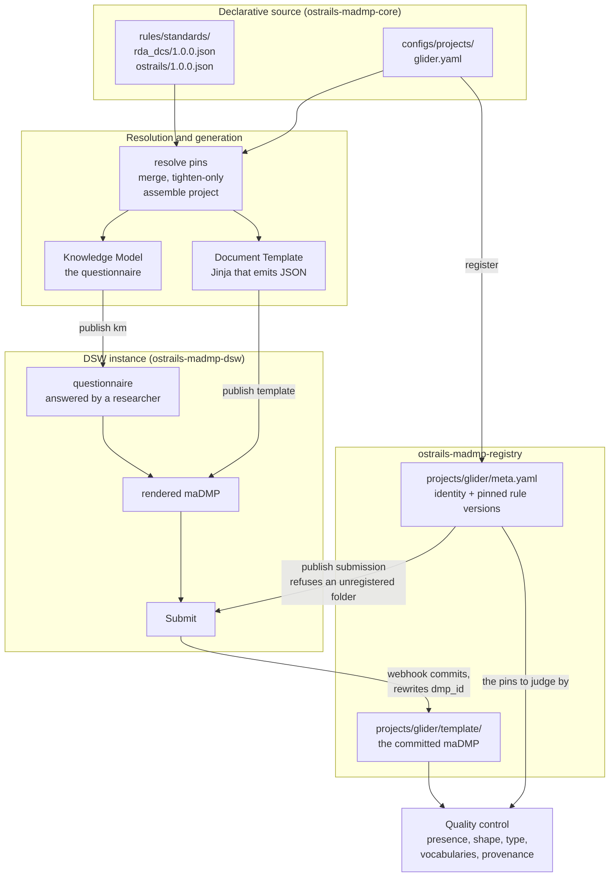
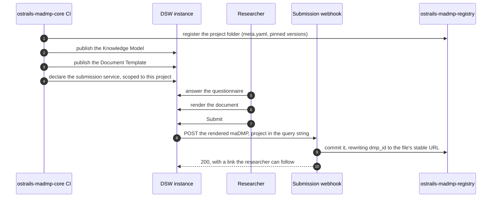

# Architecture

## Four components, and what each one knows

| component | what it is | what it knows |
|---|---|---|
| **ostrails-madmp-core** | the rules, the project configurations, the generators, the publisher | the standards and how to turn them into DSW packages. It knows an instance only as an address it was given |
| **ostrails-madmp-dsw** | a Data Stewardship Wizard 4.31 deployment, plus the submission webhook | how to run DSW, and how to commit one document into the registry. It knows nothing about rules or standards |
| **the DSW instance** | where a researcher answers | only what was published into it |
| **ostrails-madmp-registry** | a git repository, one folder per project | nothing. It is storage with a layout, and the layout is a written contract both sides honour |

The separation is deliberate and it is what makes the case transferable. A pilot
that wants the rules approach takes `ostrails-madmp-core`. A pilot that only wants a
reproducible DSW deployment with a submission hook takes `ostrails-madmp-dsw`. Neither
imports the other.

## The whole chain

Two things in that picture are worth pausing on.

**The registry is written before the submission route exists.** The webhook
refuses a folder that carries no `meta.yaml`, so a submission service pointing at
an unregistered folder would turn every Submit into a failure the researcher gets
blamed for. Publishing the route therefore checks the folder first, and refuses.
The order is enforced by the code rather than by the order of the commands, since
a convention is exactly what gets skipped when someone runs one step by hand.

**Quality control reads the registry, not the configuration.** A submitted maDMP
is judged against the rule versions recorded in `meta.yaml` next to it, not
against whatever the configuration says today. That is what makes a verdict
reproducible a year later, and it is why the merge step can be handed a set of
file paths without ever learning that a project configuration exists.

## The life of one DMP

Steps 1 to 4 are a continuous integration run and happen without anyone present.
Steps 5 to 7 are the only ones a human performs. Steps 8 to 10 take under a
second.

## What crosses a boundary, and what does not

Three interfaces carry everything, and each is small enough to write down.

- **ostrails-madmp-core to a DSW instance**: the wizard API, four endpoints. A login, the
  package listings, the bundle uploads, and one read and one write of the tenant
  configuration. No shared library, no plugin, no database access.
- **DSW to the webhook**: one HTTP POST carrying the rendered document, with the
  project folder in the query string and a bearer token in a header. The
  document itself is never parsed to decide where it goes. Routing comes from
  the URL alone, so a malformed document cannot land in another project's folder.
- **the webhook to the registry**: two calls of the GitHub contents API, read a
  file and write a file. Nothing else.

The registry layout is the one thing two codebases both depend on, and neither
of them can derive it from the other. It is therefore written down, in the
registry's own README, as a contract they both honour.
