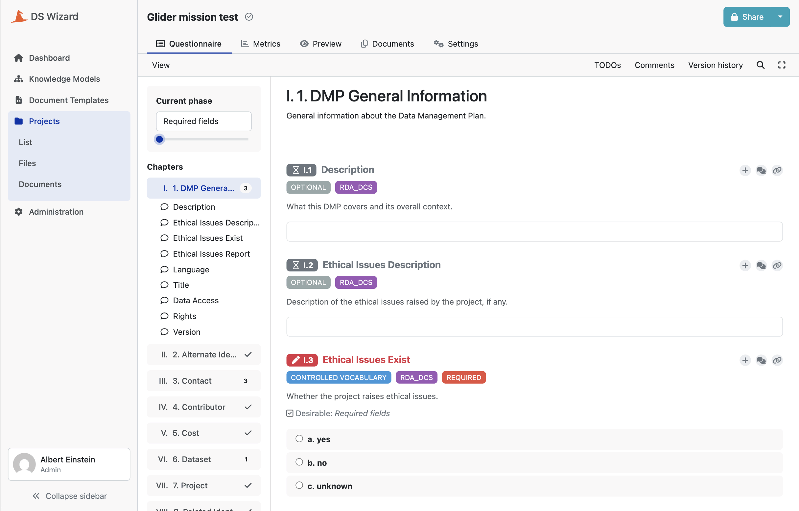
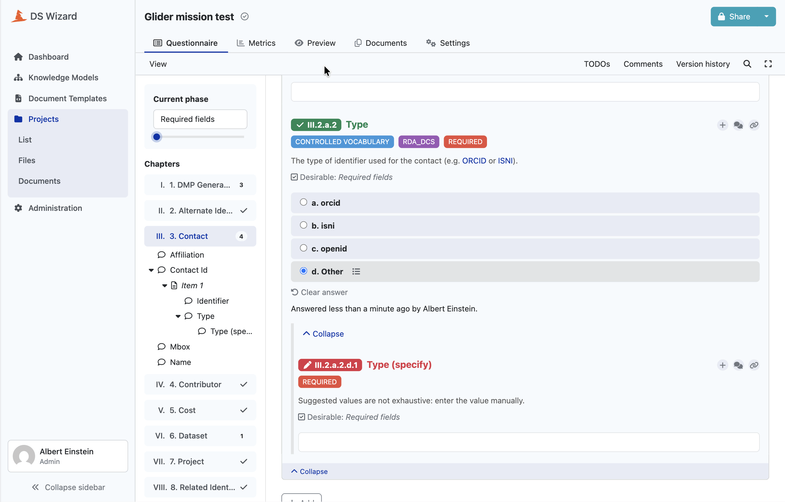

# The rules

Everything downstream is derived from files that look like this one, and a data
steward who does not read Python can edit them.

## Where a rules file lives, and what it declares

```
rules/standards/<standard>/<version>.json
```

Two files are loaded today: `rda_dcs/1.0.0.json`, the RDA DMP Common Standard,
and `ostrails/1.0.0.json`, the OSTrails Application Profile as an extension of
it. Nothing caps that number. No code enumerates the standards, a standard is a
directory, and the loader is handed one file at a time.

Each file declares its own standard name, its own version, whether it extends a
base, and a recursive tree of fields under `dmp`.

## One field, two orthogonal facts

```json
"ethical_issues_exist": {
  "_cardinality": "1",
  "_type": "string",
  "_allowed_values": ["yes", "no", "unknown"],
  "_description": "Whether the project raises ethical issues."
}
```

**Cardinality says how many.** `1` and `0..1` are single values, `1..n` and
`0..n` are lists.

**Type says what each value is.** Either `object`, or one of ten scalar formats:
`string`, `date`, `datetime`, `email`, `url`, `currency`, `language`,
`country_code`, `number`, `boolean`.

There is no `list` type on purpose. Being a list is carried entirely by
cardinality, so a file cannot contradict itself, and two files cannot contradict
each other in a way that the merge would then have to arbitrate.

## Two kinds of vocabulary, and the difference runs the whole length of the chain

- `_allowed_values` is closed. A value outside it is a **failure**.
- `_suggested_values` is a recommendation. A value outside it is a **warning**.

They may not both appear on the same field, and the loader refuses a file where
they do. A list is either closed or recommended. Declaring both would be saying
of one list that departing from it is a failure and that it is a warning.

The distinction reaches both ends of the chain. In the questionnaire, a closed
vocabulary becomes a question with no way out, and a recommended one gets an
"Other" answer that opens a free-text field beside it. In quality control, one
fails and the other warns.



*The rules excerpt above, as the researcher meets it. `_allowed_values` became
three answers and nothing else, and the tags say the constraint is a controlled
vocabulary, that it comes from the RDA standard, and that it is required. The
chapter list on the left is the top level of the same rules tree.*



*A recommended vocabulary, on the same screen. The three values the standard
suggests, then a fourth answer the rules never declared: selecting it opens a
follow-up question where the researcher writes the value the list does not have.
The tag reads the same as on a closed vocabulary, so what tells the two apart is
this escape, and it is generated rather than authored.*

### A vocabulary that names its own escape keeps the monopoly

The RDA standard ends several vocabularies with `other`, DataCite with `Other`.
That is a **value**, not a door. It says the type is outside the list, and
neither standard provides a field next to it to say which. A field declaring one
is therefore asked as a closed vocabulary, with its own value and nothing added
beside it.

This is a rule rather than a detail because two escapes for one notion made the
declared value disappear from the list the researcher was shown. On contributor
roles, a controlled and required vocabulary, the DataCite value `Other` was
missing from the twenty checkboxes and recoverable only by typing it by hand
into the neighbouring "Role (specify)" question.

The price is accepted: those fields have no free text. A creator identifier of
type `viaf` is answered `other`, and the word "viaf" is not written down. The
standard settled it by naming its own exit, and we do not add a second one.

## One spelling for a standard, everywhere it is written

A standard name is a code identifier in snake_case: `rda_dcs`, `ostrails`. The
same string, to the character, is the directory name, the declaration inside the
file, and what a project's pin writes.

Whatever a reader ends up seeing is the upper-cased form of it, produced where
it is displayed. There is no second field to keep in step with the first.

The alternative was tried and dropped: declaring a human name and deriving the
directory from a slug. It works, but it makes two namespaces linked by a
transformation that is only invertible one way, and it left a hole. Uniqueness
of standards was checked on the declared name while filing was checked on the
slug, so `RDA DCS` and `RDA_DCS` were two unique names landing in the same
directory.

The price is accepted too: display is not curated, and `OSTrails` shows as
`OSTRAILS`. That is the right price, because it makes the rule legible. A reader
seeing `RDA_DCS` and `OSTRAILS` side by side understands they are looking at
identifiers in upper case.

## Validated three ways, at the door

A malformed file must fail on the way in, not deep inside a consumer. There is
one entry point, and it validates three times.

1. **Structure.** Against a meta-schema that says what a rules file may contain:
   required keys, closed enumerations for cardinality and type, no unknown
   metadata, snake_case field names. Malformed JSON is included, so a stray
   comma comes back as a rules error rather than a parser error, and one
   exception type covers every way a rules file can be wrong.
2. **Coherence.** Five constraints kept outside the schema:
   - only object fields may declare children
   - and every object field must declare at least one, because an object *is*
     its children. Without any, it collects nothing: an empty chapter, a yes/no
     gate that opens onto nothing, list items with no question in them
   - vocabularies may only appear on scalars, since a vocabulary constrains each
     value and an object is not a value you compare to a string
   - never both vocabularies on one field
   - a chapter description may only appear on a top-level object field, the only
     one that becomes a chapter. Anywhere else the generators would ignore it
     without a word
3. **Placement.** The file declares the standard and the version its own path
   names. Without the first check, a stale directory files a standard under a
   name nobody selected. Without the second, copying `1.0.0.json` to
   `1.1.0.json` produces a new version with identical content, silently.

The coherence rules are in code rather than in the schema for one reason, and it
is not that a schema could not express them. It is that a schema cannot say
*which* field is at fault and what to write instead. It produces
`'object' should not be valid under {'const': 'object'}`.

## Every problem reported at once

Loading collects all the problems and raises once. One attempt gives one
complete list of corrections, across all three layers. A file that is both
misfiled and misversioned reports both together.

That rule has a single implementation shared by the whole codebase, rather than
being written out at each site, because a rule written several times is a rule
that can be applied by halves.

## What this looked like in practice

Three holes in the schema were closed while writing these checks, and the
instructive one is the duplicate: a vocabulary was accepting `["rt", "rt"]`. The
merge compares vocabularies as sets, so a duplicate passed without a sound and
came back out as a doubled option in the generated questionnaire. It is exactly
the class of mistake that no amount of care prevents and that a check at the
door eliminates.
