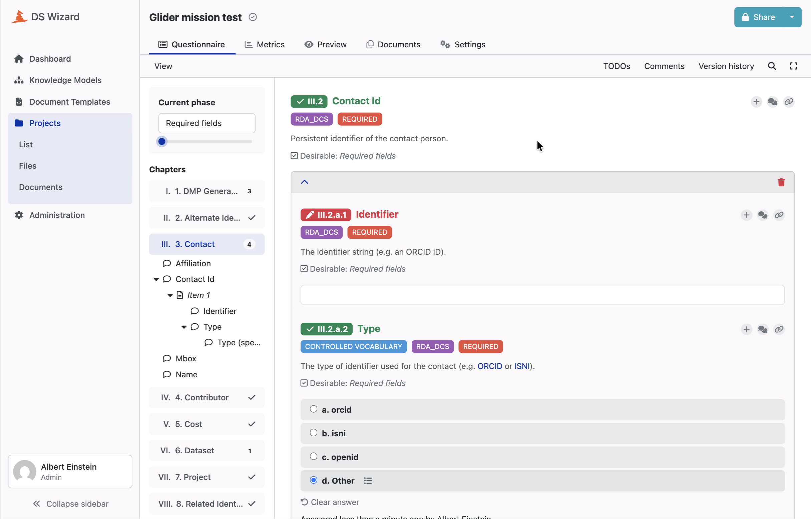

# Generation

A merged model is a questionnaire nobody can answer yet. Two programs turn it
into the two artifacts the platform consumes: a **Knowledge Model**, the
questions themselves, and a **Document Template**, the Jinja that turns a
researcher's replies into a maDMP document.

They are published as two separate packages, and the platform never checks that
they agree.

## What makes them agree

Neither generator holds a table of its own.

**Identity comes from the field path.** Every entity, chapter, question, answer
or yes/no gate, takes its UUID from a `uuid5` over the path of the rules field it
was generated for. Same field, same UUID, in both generators, without either
knowing the other ran.

**What a field becomes is decided once.** One function answers "what is this
field, logically?" with one of eleven answers: computed, list, gated object,
inline object, strict options, suggested options, their multi-choice variants,
boolean, value, repeated value. Both generators ask it and neither decides for
itself.

**And the agreement is tested without a fixture.** Both are generated, then
every path the template reads is confronted with the entities the knowledge
model emits. There is no expected output to record, which matters: recording our
own output once the oracle is gone is recording ourselves.

## From a rule to a question

| rule | platform entity |
|---|---|
| closed vocabulary | an options question with no way out |
| recommended vocabulary | an options question plus an "Other" answer opening a free-text field, unless the vocabulary already names its own escape |
| the list variants of both | a multi-choice question |
| optional object | a yes/no gate, children under the "Yes" answer |
| required object | children emitted inline |
| list of objects | a list question |
| repeated scalar | a list question with a single value question as its item template |

*Three rows of that table in one screen. `dmp.contact.contact_id` is a list of
objects, so it became a list question. Its children became the questions inside
each item, numbered under it, and the chapter tree on the left mirrors the shape
of the rules tree exactly.*

**Top-level fields split into chapters.** A top-level field becomes its own
chapter if and only if it is an object, single or list. Every top-level scalar
goes into one shared general chapter. It is a split, not a filter: every declared
field is asked, because the rules **are** the questionnaire.

**Three fields are never asked**, because their value comes entirely from the
render context. The DMP's own identifier is always computed, resolved at render
time to the document's URL inside the platform, and rewritten by the submission
webhook to its registry location on commit. Creation and modification timestamps
are optional and switched on by the project configuration.

## Emission order is load-bearing

The platform infers the order of sibling entities from the order of the events.
There is no order field to maintain, and one invariant to hold, true for any
project: no event references a parent nobody has emitted. Events are applied in
order onto an empty model, so a parent arriving later is an entity that
disappears without a sound.

The order questions are emitted in is therefore the order a researcher reads
them, and it is the order the rules file declares its fields in. A data steward
reorganising a questionnaire reorders a JSON file.

## Tags, and traceability back to the rule

Standard tags are derived from each rules file's own declaration, so adding a
file never means wiring its tag by hand. They display in upper case beside
`REQUIRED`, `OPTIONAL` and `CONTROLLED VOCABULARY`. Nine chapters and five tags
come out of the current model.

The `REQUIRED` tag does not credit the base standard for every requirement. It
names the standard that actually imposes the constraint, extensions included,
which is what the merge recorded.

**Every question also carries an annotation tracing it back to the rules field
it fills.** That is what lets a consumer relate an answer to the path it
populates, and it is what quality control will read on a submitted DMP. Every
question, including the item template of a repeated scalar: that entity has no
path distinct from its list's, but it is the one the value is stored against, so
it is the one a consumer meets while walking the answers.

## A field the metamodel does not define is not a field we send

Each event content in the platform's metamodel forbids extra properties. The
generator was nevertheless emitting two empty lists the metamodel does not have,
which produced 60 schema errors and zero after removal.

Both were inert, since order comes from the events rather than from those lists,
which explains both why nothing rejected them and why nothing was lost in
removing them. The server's decoder ignores unknown keys. **A bundle outside the
schema publishes today and is a bundle nobody else can validate.**

Two metamodel versions are pinned by hand, and they describe the **instance**
rather than the project. They were re-verified against the platform's own source
at the 4.31 tag rather than taken on trust.

## The document template

The template emits JSON as **literal text**. Nothing stands between a reply and
the file, which drives three decisions.

**Every key carries its comma in front of it**, and each optional key sits in its
own conditional block. An object's body is captured, and the comma of whichever
key ended up first is dropped. **No key therefore needs to be unconditional.**
That is the point: a standard is entitled to declare an object whose children are
all optional, and closing that object is the generator's problem rather than the
rules'. Requiring otherwise would be asking a rules file to misrepresent its
standard to suit our emitter.

**Everything that renders text is escaped**, through one macro. A value, a
vocabulary label, and above all the free text behind a synthetic "Other", which
is the one field in the questionnaire designed to take arbitrary input. The raw
readers stay raw and are never emitted: what they serve are the comparisons that
detect an "Other" answer or a boolean. Mixing the two is exactly what had left
free text unescaped, and one quotation mark there stopped the export being JSON
at all.

**A vocabulary label is source, not data.** The label table is written into the
template as Jinja literals, so a label is code the generator writes rather than
data the template reads. `Institut d'Optique` closed its literal early and the
body stopped being Jinja. Nothing would have caught it: the failure would have
happened at render time, in front of a researcher. Labels are now escaped too,
by the same function that handles identifiers rather than a separate faster one.

## Absence has to be visible

**A required field is emitted even when nothing answered it.** An empty required
field is visible in the document, an absent one is not, and a DMP missing a
mandatory field should say so rather than stay quiet.

A scalar says it with an empty string. A boolean says it with `null`, having no
empty value of its own. `false` there would be the document answering a question
nobody answered, making "not filled in" and "said no" the same document, on
fields where those two claims have nothing to do with each other.

The price is accepted and stated: neither an empty string nor `null` satisfies a
standard's own schema. Between a document that is **provably incomplete** and a
document quietly asserting something nobody said, we take the first.

## What is checked, and by what

Unit tests generate one project deeply. Continuous integration is the only place
every project goes through both generators, and what it checks is what the
**data** decides rather than what the code decides: that no entity is emitted
twice, and that the generated template body is Jinja at all.

Without those two checks, the first fault is rendered by the platform silently
dropping a question, and the second at render time, in front of a researcher.
