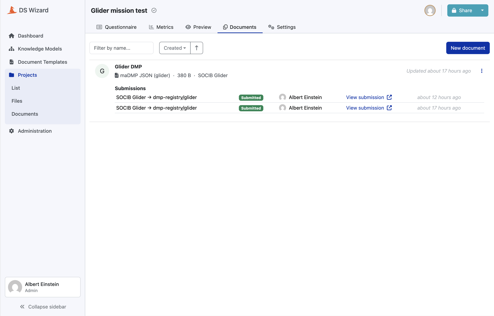
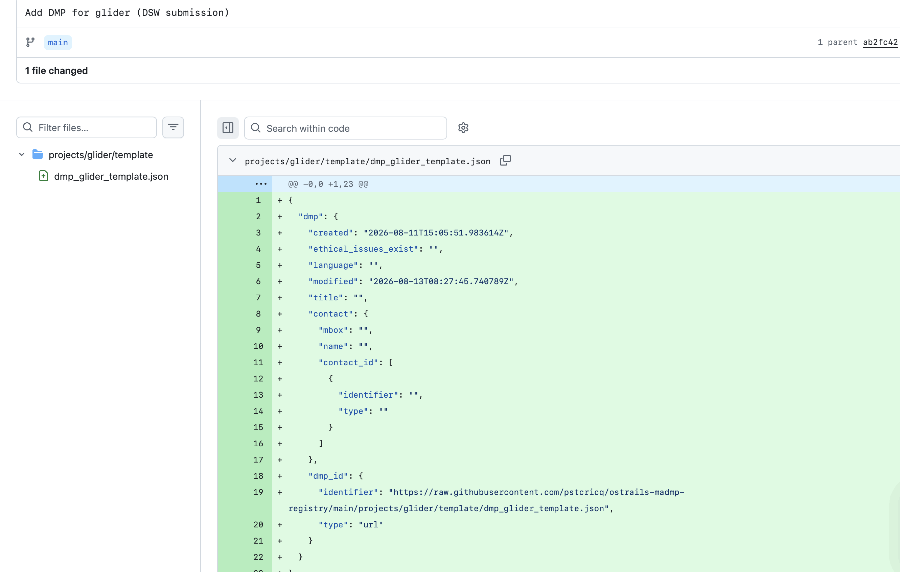

# Submission and the registry

This is where a DMP stops being a document inside a platform and becomes an
object with an address, a history, and a record of what it must be judged by.

## What a researcher does

Answer the questionnaire, render the document, click Submit. That is the whole
of it, and it is the only part a human performs.

The platform posts the rendered maDMP to the webhook over the compose network,
carrying the project's folder in the query string and a shared secret in a
header. The webhook commits the document into the registry and answers with a
link the platform displays.

| answer | meaning |
|---|---|
| 200 | committed, with the action taken: created, updated or unchanged, and a location |
| 400 | the folder is missing, unsafe or not laid out, or the body is not a DMP |
| 401 | wrong or missing token |
| 502 | GitHub refused the call, or could not be reached |

Submitting the same DMP twice commits nothing the second time.



*The rendered document, its format named after the project, and the two
submissions it has been through. The destination is the project's own registry
folder, and the platform keeps the link the webhook answered with.*

## Routing comes from the URL, never from the document

The folder in the query string is the **only** routing input the webhook has. It
never reads the document to decide where it goes, and the project identifier
pattern allows no dots and no slashes, so a submission can never write outside
its own folder. A malformed or hostile document cannot land in another project's
directory.

## The identifier gets rewritten on the way in

Until it is committed, the DMP's own identifier is a platform placeholder: the
document's URL inside that instance. The webhook rewrites it to the committed
file's stable raw URL.

That is the moment the DMP acquires an address that does not depend on a running
service. The registry branch is therefore a named constant in the code, since it
ends up inside every identifier ever issued, and moving the registry to another
branch would leave all of them pointing nowhere.



*The whole chain in one diff, and every line of it is real. The commit message
was written by the webhook rather than by a person. The `contact_id` block is a
researcher's answer arriving in the registry, and the identifier on line 19 is
the one the webhook rewrote on commit, pointing at this very file.*

## The layout, which is a written contract

```
projects/
  <id>/
    meta.yaml                   identity and pinned rule versions
    template/
      dmp_<id>_template.json    the project DMP, may still carry {placeholders}
    productions/                deployment DMPs, placeholders resolved
```

Two codebases write here, `ostrails-madmp-core` which lays a folder out, and the webhook
deployed beside the platform which drops documents into it. Neither can derive
the layout from the other, and the webhook carries **its own copy** of the GitHub
client rather than importing anything. So the layout is written down, in the
registry's own README, as the contract both honour. A change on one side reaches
the other only when somebody carries it there, which is a property rather than an
oversight: the two deploy on different schedules.

## A folder is never created by a submission

It is laid out ahead of time from the project's configuration, by continuous
integration on the default branch. The webhook refuses a folder with no metadata
file rather than half building one, because that file carries the identity and
the pinned versions the quality checks read.

Reading a folder yields one of five states, naming everything out of date in one
go: missing, registered, stale, collision, or unreadable. Two of those are
faults. A **collision** is a folder carrying another project's identity. An
**unreadable** metadata file is refused rather than rebuilt, since it holds the
only record of the rules a project's submitted DMPs are checked against.

Writing reports what it actually sent: created, updated, or unchanged. A run
reporting unchanged left no commit. It never deletes, never overwrites another
project's folder, and touches no key it does not own. The identity and the pins
belong to `ostrails-madmp-core`. Anything else the file carries is written by the
registry's own automation, carried across untouched, and never compared.

Synchronisation runs on **every** push to the default branch rather than only
when a configuration changed. The failure to prevent is drift: a pin raised in
the configuration while the registry still names the old version. Converging
every time makes that impossible instead of unlikely, and the price is not paid,
since nothing is sent when nothing has changed.

## One plan, many realisations

This is the part that answers the oldest objection made to Data Management
Plans, that they describe intentions and never what happened.

The document in `template/` is the **generic plan**. For an observing
infrastructure, much of it is genuinely fixed: what an instrument is, what it
measures, how its data is processed, licensed, and archived. What varies from one
deployment to the next is a bounded set of facts, dates, platform, area,
settings, the resulting datasets. Those appear in the generic plan as
`{snake_case}` placeholders.

Each entry in `productions/` is that plan **resolved** with the real values of
one deployment. One plan, N concrete documents, each dated, each a diff, each
traceable back to the plan it derives from.

**Status, stated plainly.** The layout exists, the contract is written, and the
identifier pattern and folder rules are enforced. The generic plan is produced
today by the chain described in this document. What is **not** built yet is the
resolution step, the program that takes a production's real values and fills the
placeholders in. That is in [section 14](14-what-is-next.md), and it is the piece that turns the Track
dimension from "documents are versioned" into "every deployment has its own
plan".

## The registry is a versioned database, not a publication surface

It is private, and that is a design decision rather than a stage we have not
reached. Its job is to be the authoritative, versioned store: every submitted
DMP, every revision, and the rule versions each one is judged by.

Making DMPs **public** is a separate step downstream, and it is selective. The
DMPs we decide to publish will be pushed from here to a platform whose job is
publication, with the identifiers and metadata that entails. Conflating the two
would mean either publishing drafts because they were submitted, or holding back
the store because not everything in it is ready to be public.

Two consequences worth noting. Reading the registry needs a token even for a
check, so continuous integration abstains loudly rather than reporting a project
as missing when the truth is "wrong credentials". And the stable URL a submitted
DMP's identifier points at today is a registry URL, which is the right address
for the authoritative copy and not necessarily the address a published DMP will
eventually be cited by.

## What the registry gives the Track dimension

- **A stable address per document**, independent of any running service.
- **A history.** Every DMP is a commit. What changed, when, and against what is a
  diff rather than a claim.
- **The rules it must be judged by, stored beside it.** A verdict reached today
  stays reproducible, because the versions are recorded rather than inferred from
  whatever the configuration says later.
- **Nobody needs an account.** Every DMP here is written by a bot. Researchers
  fill in the platform and click Submit.
- **An entry point rather than an endpoint.** A committed plan is what the
  Scientific Knowledge Graph attaches digital objects to, so a maDMP is where
  navigating the research lifecycle starts rather than where it stops.

## Two operational details worth passing on

**A 404 from the GitHub API is an absence on a read and a failure on a write.**
Treating it as an absence in the transport layer would mean a refused write, from
a revoked token, a renamed repository or a wrong owner, returns nothing instead
of raising, and the webhook answers 200 with a link to a file that was never
written. The platform would display a successful submission and the DMP would be
lost in silence.

**Idempotence stops above one megabyte.** The GitHub API inlines a file's content
up to that size and returns it empty above. A DMP that large never compares equal
to what is stored, so every submission commits again instead of reporting
unchanged. Nothing breaks, the guarantee quietly stops holding. It is written
down for the day a DMP gets that big.
