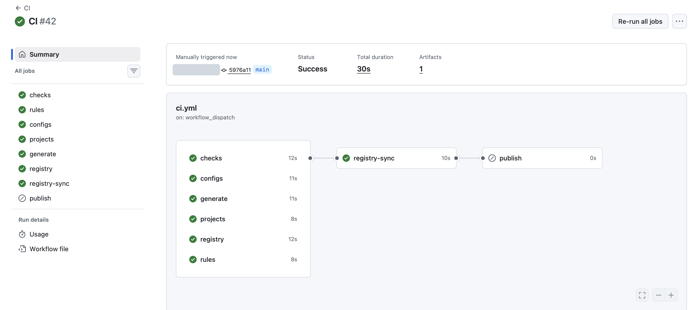

# Engineering practices

Nothing in this section is specific to DMPs. It is here because a proof of
concept that cannot be rerun by someone else is a demonstration rather than an
implementation, and because two or three of these choices are the ones we would
most recommend copying.

## Report, or act

Continuous integration has eight jobs, and the line between them is not "before
or after validation". It is **report or act**.

Six jobs only report. They run in parallel, none waits on another, and each
names its own culprit:

| job | what it checks |
|---|---|
| checks | lint, formatting, and the test suite. Anything about the shape of the code |
| rules | every rules file is loaded, which is what validates it: schema, coherence, placement |
| configs | every project configuration is loaded and checked against its own filename |
| projects | every configuration resolved and merged the way a generator does it. The only job that sees a *combination* |
| generate | every project through both generators. What the **data** decides: no entity emitted twice, and a template that parses |
| registry | every project's destination, read: free, or already its own. The only job that looks outside |

Two jobs act, and they wait for every verdict and for each other. One writes into
the registry repository. The other writes into a platform instance, and it comes
second, because a submission route pointing at an unregistered folder would break
every Submit.

*The rule, drawn by the tool itself. Six jobs report, in one parallel block,
each naming its own culprit. Two act, and they are strung out after them:
`registry-sync` writes into the registry, then `publish` writes into a platform
instance. `publish` here is skipped, and the greyed circle is the point of the
next paragraph.*

Both abstain visibly rather than invisibly. On a pull request the writing jobs
show as skipped, so their abstention is readable in the list of checks instead of
passing unnoticed. The publishing job is gated on a repository variable rather
than commented out, for the same reason.

The three data jobs fail for different reasons and get fixed by different people:
a code change, a rules change, a new project. That is why they are three jobs and
not one.

## What we test, and what we refuse to test

**No golden test where there is no expected output.** Freezing our own output
once the oracle is gone is recording ourselves. What gets tested is what has a
specification, and invariants true for any project rather than facts true of this
one.

The consequence is visible in how the two generated packages are checked against
each other. Rather than comparing them to a stored copy, both are generated and
every path the template reads is confronted with the entities the questionnaire
emits. That test keeps working when the rules change, which a stored copy would
not.

Two things are deliberately frozen against previously published values, and they
are frozen because they are **identity** rather than output: the derived
identifier convention, held by nine values, one per kind of entity, and the two
metamodel versions, re-verified against the platform's own source rather than
taken on trust.

**A double that agrees with the code about a shape neither of them owns is not
testing anything.** That is the lesson from [section 10](10-publication.md), and it changed how the
platform is faked in tests: the fake now returns what the platform returns, not
what our code writes.

Current counts: 297 tests on the generator side, 39 on the webhook.

## Reproducibility

Every job installs from a committed lockfile, so the code runs against the same
dependency versions on a laptop, on a runner, and in a container. The webhook's
container image installs from a requirements file **generated** from that same
lockfile with hashes, and continuous integration regenerates it and fails on a
diff. Drift between the two is impossible rather than discouraged.

**Dependencies are earned.** Each package declares only what its code actually
imports. Both the platform client and the GitHub client are standard library
only, which is why neither pulls a dependency into a container that has to be
audited later.

## Each destination owns its client, and each package knows one thing

The rule that keeps the layout stable is not "how many modules use this", it is
**what does this module know**. The platform package carries the platform client.
The registry package carries the GitHub client. Shared utilities are for what
several packages genuinely share.

That criterion is the one that can **refuse** an addition, which is what a
layout rule is for. It is written into each package rather than left implicit,
and it is what makes it obvious that a resolution step should not know about
output paths, or that a transport layer should not leak an encoding into the
module above it.

## Three places to write things down, and one rule each

- **The README says what the repository holds today and how to run it**, and it
  says only what is verified. Nothing aspirational.
- **A design document says why it is built this way**, including the
  alternatives turned down and what they cost. It is where a decision goes when
  it is a decision rather than a fact.
- **Code comments explain the code**, and nothing else. Anything that is a
  decision, a rejected alternative, or a historical constraint lives in the
  design document.

The split matters more than it sounds, because the three age differently. A
README that describes a plan rots on the first day the plan changes. A design
document that repeats the code rots on the first refactor. Keeping each to its
own question is what makes them worth reading a year later, and this deliverable
was assembled from them.
