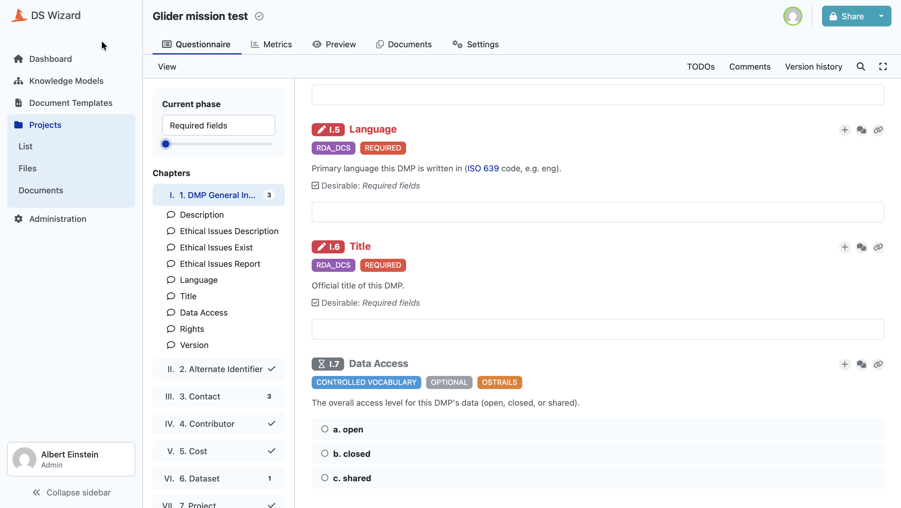

# At a glance

!!! info "About this document"

    Technical documentation of a maDMP implementation built at **SOCIB**, the
    Balearic Islands Coastal Observing and Forecasting System, as a thematic
    pilot of **OSTrails**.

    Contributed to deliverable **D4.3, Case Studies and Proof of Concept
    Instances**, August 2026.

    Pierre St-Cricq dit Lompre, Miguel Charcos Llorens and Oana Dragomir, SOCIB.
    OSTrails is funded by the European Union under HORIZON-INFRA-2023-EOSC-01,
    grant agreement 101130187.

## In one sentence

> A rule added to a JSON file becomes a DSW question **and** a quality check,
> with no code and no room for drift.

## What this is

A working implementation of the OSTrails **Plan** pathway, built and tested at
SOCIB. A declarative rule set, the RDA DMP Common Standard with the OSTrails
Application Profile on top of it, is the only source of truth. Everything a
researcher meets is derived from it mechanically: the questionnaire they fill in
inside a Data Stewardship Wizard instance, the machine-actionable DMP their
answers render into, and the quality control that document is checked against.

The rendered maDMP is then committed into a git registry, which gives it a
stable identifier, a history, and a record of the exact rule versions it must be
judged by.

Nothing in the approach is specific to SOCIB, and nothing in it is specific to
the two standards currently loaded. A national or thematic profile is one more
JSON file, not one more branch of code.

*Nobody built this questionnaire. Every chapter, question, vocabulary and tag in
it was derived from two JSON rules files. The tags are the part to look at: `I.5`
and `I.6` come from the RDA standard and are required, `I.7` comes from the
OSTrails profile and is optional, and the researcher can see which standard asks
for what.*

## Status

**Tested, deploying for operations.** Nothing in the pilot is operational yet,
and parts of it are deployed and being tested. The chain described here runs end
to end, on a local deployment and against a remote instance. A researcher has
filled in the generated questionnaire, clicked Submit, and the resulting maDMP
was committed to the registry with its identifier rewritten to a stable URL. What
it has not had yet is a real project of a real research group going through it in
production.

## Mapping to Plan, Track, Assess

| dimension | what this case demonstrates | status |
|---|---|---|
| **Plan** | maDMP rules as data, DSW questionnaire and document template generated from them, published into an instance automatically | implemented and tested |
| **Track** | the rendered maDMP committed to a git registry, its `dmp_id` rewritten to a stable URL, the rule versions it was built from frozen alongside it, every change a diff. On top of that, the OSTrails and RDA models are the foundation of the Scientific Knowledge Graph built within JERICO and Blue-Cloud, where a maDMP acts as the entry point to the datasets, software, services and publications it concerns, and to their relationships and provenance | the registry is implemented and tested. The graph is implemented for this pilot, and its extension to external graphs through SKG-IF, along with a persistent identifier strategy across infrastructures, is in progress |
| **Assess** | three layers, on three kinds of evidence: whether the plan says valid things, derived from the same rules that generated the questionnaire, whether the data match what the plan promised, and whether the described outputs are FAIR and their links hold | the first is written and exercised and is being ported. The second exists as a Python quality control of datasets and metadata, used outside the pipeline and to be folded into it. The third is open |

## The three mechanisms worth copying

The point of this case study is not the DMP. It is what makes a questionnaire, a
document template and a validator stay in agreement without anyone having to
keep them in agreement.

1. **Deterministic identity.** Every entity in the generated packages takes its
   UUID from the path of the rules field it was generated for. Two programs that
   share no lookup table therefore produce packages that reference the same
   entities. A document template structurally cannot point at a question its
   knowledge model does not have.
2. **A single decision point.** What a rules field *becomes*, a list, a gated
   object, a strict vocabulary, a repeated scalar, is decided in one function
   that every generator asks. Two generators cannot disagree about an edge case,
   because there is only one place where the answer exists.
3. **Tighten-only merging.** Profiles stack onto a base standard under one
   invariant: a document valid under the merged model stays valid under each
   standard taken on its own. A profile may make a field required or narrow a
   vocabulary. It may not loosen, reshape, or widen. Where two profiles disagree,
   the merge says so by name instead of letting one quietly win.

## By the numbers

Measured on the current state of the repositories.

| | |
|---|---|
| standards loaded | 2: RDA DCS as base (146 fields), OSTrails as extension (21 fields, 17 of them new) |
| generated knowledge model | 492 events, 9 chapters, 171 questions, 265 answers |
| question types emitted | 109 value, 31 options, 29 list, 2 multi-choice |
| generated document template | 84 022 characters of Jinja |
| tests | 297 on the generator side, 39 on the submission webhook |
| continuous integration | 8 jobs, of which 2 write outside their own repository |
| deployment | Data Stewardship Wizard 4.31, 7 containers |

## Where the code is

| | |
|---|---|
| the rules, the generators, the publisher | <https://github.com/pstcricq/ostrails-madmp-core> |
| the platform deployment and the submission webhook | <https://github.com/pstcricq/ostrails-madmp-dsw> |
| the registry the rendered plans are committed to | <https://github.com/pstcricq/ostrails-madmp-registry> |
| this documentation | <https://github.com/pstcricq/ostrails-madmp-documentations> |

Access to the three implementation repositories is being opened. If a link does
not resolve for you, write to us and we will send it.

## Contents

The document is meant to be read in order, and it is written so that three
audiences can stop at different points.

[Section 2](02-context.md) says where this work comes from, what already
existed around it, and where it goes. It is the wider pilot, of which the rest of
this document is one component.

**Sections 3 to 5** say what problem this addresses and how the pieces fit.
They assume no knowledge of the tooling.

| | |
|---|---|
| [3. The problem](03-the-problem.md) | three artifacts kept in agreement by hand, and a plan that describes nothing that happened |
| [4. The principle](04-the-principle.md) | rules as the only source of truth, what is derived, and what that costs |
| [5. Architecture](05-architecture.md) | four components, what each one knows, and the whole chain as a diagram |

**Sections 6 to 13** follow one rule all the way to a committed DMP, in order.
They stay at the level of the mechanism rather than the code, with real
excerpts and screenshots.

| | |
|---|---|
| [6. The rules](06-the-rules.md) | the format a data steward edits, and the three checks it faces at the door |
| [7. Standards and profiles](07-standards-and-profiles.md) | how a profile stacks onto a base standard without ever loosening it |
| [8. A project](08-a-project.md) | one configuration file, and what it resolves to |
| [9. Generation](09-generation.md) | from a rule to a question, and from an answer to a document |
| [10. Publication](10-publication.md) | pushing packages into a running instance without overwriting anyone |
| [11. The deployment](11-the-deployment.md) | a reproducible platform stack, reusable on its own |
| [12. Submission and the registry](12-submission-and-registry.md) | from Submit to a commit, and one plan to many realisations |
| [13. Engineering practices](13-engineering-practices.md) | report or act, what we test, and what we refuse to test |

**Sections 14 to 17** are the roadmap, the lessons, the limits we have not
solved, and the material to reproduce any of it.

| | |
|---|---|
| [14. What is next](14-what-is-next.md) | committed, waiting on something specific, and still being decided |
| [15. Lessons](15-lessons.md) | seven of them, plus the platform pitfalls that each cost us an afternoon |
| [16. Known limits](16-known-limits.md) | what we have not solved, each with what would make us reconsider |
| [17. Annexes](17-annexes.md) | real excerpts, the commands to reproduce, references and contacts |

In a hurry, and only reading two things: [the principle](04-the-principle.md)
and [the lessons](15-lessons.md).
